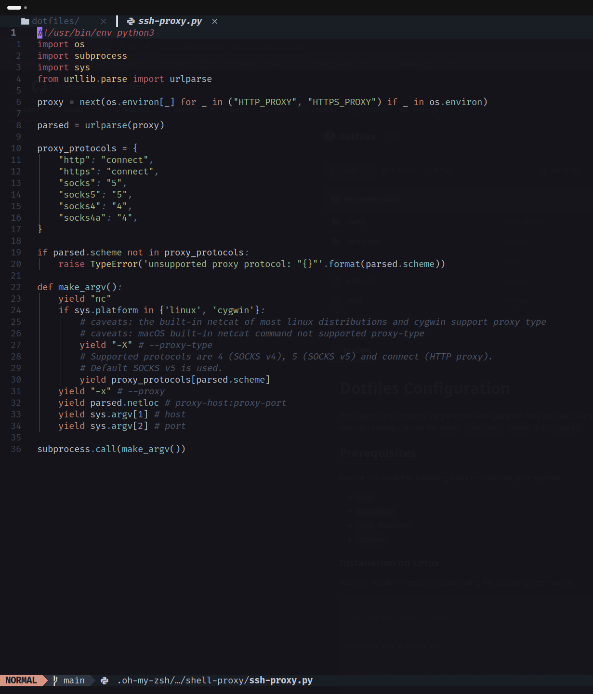

# Dotfiles Configuration


This repository contains my personal configuration files (dotfiles) for various tools and applications. The setup includes configurations for `stow`, `alacritty`, `nvim`, and `ripgrep`.

## Prerequisites

Ensure you have the following tools installed on your system:

- `stow`
- `alacritty`
- `nvim` (Neovim)
- `ripgrep`

### Installation on Linux

You can install the required tools using the following commands:

```sh
# Install stow
sudo apt-get install stow

# Install zsh
sudo apt-get install zsh

# Install oh-my-zsh
sh -c "$(curl -fsSL https://raw.githubusercontent.com/ohmyzsh/ohmyzsh/master/tools/install.sh)"

#
# Install alacritty
sudo add-apt-repository ppa:aslatter/ppa
sudo apt-get update
sudo apt-get install alacritty

# Install neovim
sudo apt-get install neovim

# Install ripgrep
sudo apt-get install ripgrep


/bin/bash -c "$(curl -fsSL https://raw.githubusercontent.com/Homebrew/install/HEAD/install.sh)"

brew install zsh-autosuggestions
brew install zsh-syntax-highlighting
brew install eza
brew install zoxide
brew install tmux
brew install bash
brew install node
```

## Setup

1. Clone this repository to your home directory:

```sh
git clone https://github.com/ahmedashraf093/dotfiles.git ~/dotfiles
```

2. Navigate to the dotfiles directory:

```sh
cd ~/dotfiles
```

3. Use `stow` to create symlinks for the configuration files:

```sh
stow .
```

This will create symlinks in your home directory pointing to the configuration files in the `dotfiles` repository.

## Usage

- **Alacritty**: Launch the terminal emulator using the `alacritty` command.
- **Neovim**: Open Neovim using the `nvim` command.
- **Ripgrep**: Use `rg` to search for text within files.

## Contributing

Feel free to fork this repository and submit pull requests if you have any improvements or additional configurations to share.

## License

This project is licensed under the MIT License. See the [LICENSE](LICENSE) file for details.

---

Happy coding!
